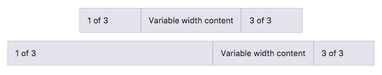

# Bootstrap

## 目的

- Bootstrapの読み込み方法を学ぶ。
- Bootstrapのグリッドを利用したレスポンシブサイト作成方法を学ぶ。

## Bootstrapとは？

Bootstrapとは、twitter社が開発元のHTML、CSS、JavaScriptからなる、**外部ライブラリ**です。レスポンシブデザイン作成の時に便利なツールが用意されていたり、twitter開発元ということもあって、twitterのサイトで使用されているデザインがベースとなった、整ったデザインを簡単に実装することができます。

先日までver 3系が使用されていましたが、現在はver 4.0.0-beta.2になり、以前とは少し異なった書き方をする箇所があります。CodeGirtでは、最新バージョン（2017年12月現在）のver 4.0.0-beta.2を元に学んでいきます。

## Bootstrapの公式ドキュメント


プログラミングを学習するにあたり、それぞれの言語やフレームワーク、外部ライブラリの公式ドキュメントをチェックするのは基本的なことですが、実はとても大事なことです。

Bootstrapも同じで、必ずオンライン上にある公式ドキュメントを確認しながら、わからないときは公式ドキュメントと照らし合わせながら学習していきましょう。

Bootstrapの公式ドキュメントは英語ですが、プログラミング学習の情報が豊富なのは圧倒的に英語ソースですので、この機会に慣れていきましょう。
わからない場合はオンラインやパソコン内の辞書で対応していくと早いです。

### Bootstrap：公式ドキュメント https://getbootstrap.com/

## Bootstrapの適用の仕方（外部ライブラリとして読み込む方法）

Bootstrapを使用するには、まず外部ライブラリとしてコードファイルに読み込む必要があります。
Bootstrapは先ほど冒頭でも学んだ通り、HTML、CSS、JavaScriptでできたライブラリなので、BootstrapのCSSとJavaScriptを読み込みます。

今回はCDN（Content Delivery Network）という方法を使って読み込みます。
CDNは、Bootstrapのような公開ライブラリを誰でも自由に使えるようにWeb上に設置（ホスティング）してくれているサイトのことであり、通常のCSSファイルの読み込み方や、JavaScriptファイルの読み込み方と同様、HTMLファイルに以下のように読み込みます。

```html
<!DOCTYPE html>
<html lang="ja">
  <head>
    <meta charset="utf-8" />
    <title>Bootstrapページ</title>
    <!-- viewport 読み込み -->
    <meta name="viewport" content="width=device-width, initial-scale=1" />

    <!-- Bootstrap css -->
    <link rel="stylesheet" href="https://maxcdn.bootstrapcdn.com/bootstrap/4.0.0-beta.2/css/bootstrap.min.css" integrity="sha384-PsH8R72JQ3SOdhVi3uxftmaW6Vc51MKb0q5P2rRUpPvrszuE4W1povHYgTpBfshb" crossorigin="anonymous">

    <!-- このファイルページのcss file -->
    <link rel="stylesheet" href="style.css" />
  </head>
  <body>
    <div class="contents">
      <!-- コンテンツ -->
    </div>

    <!-- Bootstrap jQuery -->
    <script src="https://code.jquery.com/jquery-3.2.1.slim.min.js" integrity="sha384-KJ3o2DKtIkvYIK3UENzmM7KCkRr/rE9/Qpg6aAZGJwFDMVNA/GpGFF93hXpG5KkN" crossorigin="anonymous"></script>
    <!-- Bootstrap Popper.js -->
    <script src="https://cdnjs.cloudflare.com/ajax/libs/popper.js/1.12.3/umd/popper.min.js" integrity="sha384-vFJXuSJphROIrBnz7yo7oB41mKfc8JzQZiCq4NCceLEaO4IHwicKwpJf9c9IpFgh" crossorigin="anonymous"></script>

    <!-- Bootstrap js -->
    <script src="https://maxcdn.bootstrapcdn.com/bootstrap/4.0.0-beta.2/js/bootstrap.min.js" integrity="sha384-alpBpkh1PFOepccYVYDB4do5UnbKysX5WZXm3XxPqe5iKTfUKjNkCk9SaVuEZflJ" crossorigin="anonymous"></script>

    <!-- このファイルページのjs file -->
    <script src="main.js"></script>
  </body>
</html>
```

CDNを使わずに自分のサイトに設置する場合は、Bootstrapのzipファイルをダウンロードして、階層構造を保ったまま、全てまとめてサーバーにアップロードする必要があります。
ただし、CSSとJavaScriptは含まれていますが、JavaScriptを使用するのに必要なjQueryやPopper.jsは、ダウンロードする場合には含まれていないことに留意する必要があります。
そのほかにも読み込む方法はありますが、SassやRubyが必要になる場合になるため、現段階ではCDNの読み込みをここでは紹介しています。

読み込む時の注意点として、JavaScriptの機能を使用する場合は、jQueryとPopper.jsの読み込みが必要になることと、JavaScriptの前にjQueryとPopper.jsを読み込む必要があるので、注意しましょう。

## viewportの設定

Bootstrapはレスポンシブデザインのページを作成する上で、とても便利なライブラリです。
ただし、レスポンシブデザインのサイトを作成する際には必ずモバイル端末用に、上記のソースコードのように `viewport` の設定が必要です。

 `viewport` は `Class 8のレスポンシブデザイン` の内容でも学んでいますので、詳細はそちらを参照してください。


## Bootstrapでレスポンシブ対応させる（グリッド）

Bootstrapのグリッド（Grid）を使うと、とても簡単に整ったレスポンシブデザインのページを作成することが可能です。
 `flexbox` を使用して作られているので、レイアウトもしやすいのが特徴です。

公式ドキュメントにも詳細は載っているので、ここで一部抜粋して基本的な使い方を紹介していきます。

まずは基礎的な使い方から見ていきましょう。

## グリッドOptions

Bootstrapのグリッドは`px`単位でブレークポイント（画面が切り替わる横幅の基準）を決めています。
公式ドキュメントにある使用例の一覧をまずは見てみましょう。

Bootstrapには**グリッドシステム**という仕組みがあり、横幅を12カラムとして、均等に区切ったときに、何カラム分の横幅を割り当てるかを指定するだけで要素を配置していくことが可能です。


レスポンシブデザインはグリッドを使えば全て解決するというわけではないので、グリッドは必要に応じて使えばよく、グリッドを使わずにページを作る方が良い場合も状況に応じてあります。


### 実例１：基本滴な使い方

実際にグリッドを使ってみましょう。

```html
<div class="container">
  <div class="row">
    <div class="col-sm">
      One of three columns
    </div>
    <div class="col-sm">
      One of three columns
    </div>
    <div class="col-sm">
      One of three columns
    </div>
  </div><!-- /.row -->
</div>
```


 `col-sm` の `sm` は `smallサイズ` という意味合いで書かれています。
 `col-` の後にサイズ指定を以下の一覧表にある指定されたサイズ表記で書いていくことで、横幅を調整することができます。

smallサイズより大きい幅で設定したい場合は `md` `lg` `xl` にサイズを変更することで設定できます。


もう一つ、グリッドを使用する際に気をつけておくこととして、グリッドを使用する要素を上記のソースコードのように `div` タグで `row` クラスに設定して囲む必要があります。
さらに、 `<div class="row"></div>` で囲んである `div` 要素を囲む、 `<div class="container"></div>` も、上記 `row` の親要素としてそれぞれの要素を均等にページ内に配置させるために設定が必要です。

下記にも例を示していますが、この書き方は `Equal-Width` という書き方です。  `Equal-Width` は、自動的に要素の幅がそれぞれ均等になるように配置することができます。
上記の例だと、 `sm` とサイズの指定をしているので、 `sm` サイズで要素全てが均等な横幅になるように配置されています。

### 実例２：Equal-Width

上記の例とは少し異なる書き方ですが、同じ `Equal-Width` とカテゴライズされる書き方です。
上記と異なり、サイズの指定をしていませんが、全ての要素の幅が均等になります。
この書き方を `predefined grid class` と言います。

```html
<div class="container">
  <div class="row">
    <div class="col">
      1 of 2
    </div>
    <div class="col">
      2 of 2
    </div>
  </div><!-- /.row -->
  <div class="row">
    <div class="col">
      1 of 3
    </div>
    <div class="col">
      2 of 3
    </div>
    <div class="col">
      3 of 3
    </div>
  </div><!-- /.row -->
</div><!-- /.container -->
```


こちらの実例２では、サイズの指定をする表記をしていませんが、どの端末、viewportにも対応しています。
全ての要素が横幅いっぱいに均等に並んでいるのが確認できますね。
ただし、Safariにはflexboxのバグでうまく表示がされない場合もあるため、基本的にはサイズの指定をする表記を書くことを勧めます。

### 実例３：中央の1カラムの幅だけ設定し、残りの要素は自動設定

flexboxの `auto-layout` という性質を利用した書き方です。
1つの特定の要素のみ横幅の長さを決めたら、残りの隣り合う要素は自動で横幅を調整してくれるという大変便利な機能です。
中央にある要素がどんなサイズだろうと、両端にある要素はリサイズするので、中央の要素だけサイズを変えたいときに推奨される書き方です。
中央の要素だけサイズを決めればいいので、両端の要素は、 `predefined grid class` でも構いません。

```html
<div class="container">
  <div class="row">
    <div class="col">
      1 of 3
    </div>
    <div class="col-6">
      2 of 3 (wider)
    </div>
    <div class="col">
      3 of 3
    </div>
  </div><!-- /.row -->
  <div class="row">
    <div class="col">
      1 of 3
    </div>
    <div class="col-5">
      2 of 3 (wider)
    </div>
    <div class="col">
      3 of 3
    </div>
  </div><!-- /.row -->
</div><!-- /.container -->
```


ここではサイズ指定してある中央の要素に数字でサイズ指定がされています。
Bootstrapでは全体の横幅を12等分して均等に分割する仕組みなので、数字で設定することでより細かいサイズ指定ができます。

### 実例４：横幅に変数を指定する（Variable width content）

 `col-{breakpoint}-auto` をクラス属性に使用することで、要素の横幅を決めることもできます。
 `col-{breakpoint}-auto` の `breakpoint` には `sm` や `lg` などの表記でサイズを決めることができます。
`col-{breakpoint}-数字` はver 3でもよく使われていた書き方で、12カラムを基準とした時の横幅をさらに調整できます。

```html
<div class="container">
  <div class="row justify-content-md-center">
    <div class="col col-lg-2">
      1 of 3
    </div>
    <div class="col-md-auto">
      Variable width content
    </div>
    <div class="col col-lg-2">
      3 of 3
    </div>
  </div><!-- /.row /.justify-content-md-center -->
  <div class="row">
    <div class="col">
      1 of 3
    </div>
    <div class="col-md-auto">
      Variable width content
    </div>
    <div class="col col-lg-2">
      3 of 3
    </div>
  </div><!-- /.row -->
</div><!-- /.container -->
```



### 実例５：Equal-width multi-row

 `Equal-width multi-row` の仕組みを使うことで、要素を全て横一列に並列させるだけでなく、ブレークポイントを指定した箇所からはレスポンシブ対応で、複数の行（multi-row）に指定することができます。

```html
<div class="row">
  <div class="col">col</div>
  <div class="col">col</div>
  <div class="w-100"></div><!-- w-100 をブレークポイントしたい箇所に指定する-->
  <div class="col">col</div>
  <div class="col">col</div>
</div><!-- /.row -->
```


 `<div class="w-100"></div>` の箇所以降にある要素2つが、改行されて全体で2段構造に指定されているのがわかりますね。

 `Equal-width multi-row` を有効化させるには、 `w-100` をブレークポイント箇所に書くことで有効化されます。

## レスポンシブ クラス

### 実例１：全端末統一する場合のブレークポイント（All breakpoints）

モバイルからデスクトップまで全端末同じ表示のさせ方で要素を配置したい場合は、この `All breakpoints` の方法が使えます。

 `col` で全要素を均等に自動調整させるか、 `col-数字` で特定の要素だけ横幅を指定するかどちらでも構いません。

```html
<div class="row">
  <div class="col">col</div>
  <div class="col">col</div>
  <div class="col">col</div>
  <div class="col">col</div>
</div><!-- /.row -->
<div class="row">
  <div class="col-8">col-8</div>
  <div class="col-4">col-4</div>
</div><!-- /.row -->
```


### 実例２：組み合わせて使う（Mix and match）

全端末統一して要素の配置を設定することは、レスポンシブデザインが主流になっている今、あまり使う頻度はそうないでしょう。

レスポンシブデザインをより細かく、かつ簡単に実装できるよう開発されたBootstrapなので、もちろん、端末によって細かく指定する方法も用意されています。

以下の例を見てみましょう。

```html
<!-- col-12はモバイルだと全画面、col-6はモバイルだと50%の横幅 -->
<div class="row">
  <div class="col-12 col-md-8">.col-12 .col-md-8</div>
  <div class="col-6 col-md-4">.col-6 .col-md-4</div>
</div><!-- /.row -->

<!-- col-6はモバイルだと50%幅、col-md-4はデスクトップになった時には要素が33.3%になる -->
<div class="row">
  <div class="col-6 col-md-4">.col-6 .col-md-4</div>
  <div class="col-6 col-md-4">.col-6 .col-md-4</div>
  <div class="col-6 col-md-4">.col-6 .col-md-4</div>
</div><!-- /.row -->

<!-- モバイルでもデスクトップでも常に50%幅 -->
<div class="row">
  <div class="col-6">.col-6</div>
  <div class="col-6">.col-6</div>
</div><!-- /.row -->
```


1行目の要素はモバイル画面とそれ以外の端末の時とで、要素の配列指定を変えています。
モバイル画面では全体で2行になり、それ以外の端末では要素を並列させて1行に納めています。

2行目の要素はモバイル端末とデスクトップ端末になった場合でブレークポイントを指定しています。
モバイルでは全ての要素が均等に50%幅ずつになるのに対し、デスクトップでは33.3%に横幅が変わるよう指定しています。

3行目の要素は、レスポンシブデザインではなく、全端末で同じ表示をさせる指定です。
要素がそれぞれ50%ずつで並列してどの端末でも表示されるように指定しています。

## その他の応用方法

その他にも、要素間で間隔を開けるなどの方法もありますが、基本的にはflexboxでも似たことができるので、詳細はBootstrap公式ドキュメントを参照しましょう。

## チャレンジ

[チャレンジ11](./challenge/README.md)

## 更に学ぼう

### 記事、リソース

Bootstrap 公式ドキュメント https://getbootstrap.com/
