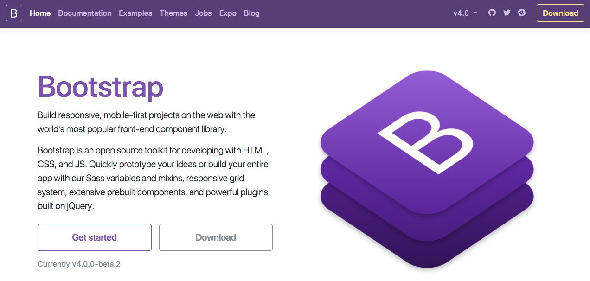

## Bootstrapとは？

Bootstrapとは、twitter社が開発元のHTML、CSS、JavaScriptからなる、**外部ライブラリ**です。レスポンシブデザイン作成の時に便利なツールが用意されていたり、twitter開発元ということもあって、twitterのサイトで使用されているデザインがベースとなった、整ったデザインを簡単に実装することができます。

先日までver 3系が使用されていましたが、現在はver 4.0.0-beta.2になり、以前とは少し異なった書き方をする箇所があります。CodeGirtでは、最新バージョン（2017年12月現在）のver 4.0.0-beta.2を元に学んでいきます。

## Bootstrapの公式ドキュメント



プログラミングを学習するにあたり、それぞれの言語やフレームワーク、外部ライブラリの公式ドキュメントをチェックするのは基本的なことですが、実はとても大事なことです。

Bootstrapも同じで、必ずオンライン上にある公式ドキュメントを確認しながら、わからないときは公式ドキュメントと照らし合わせながら学習していきましょう。

Bootstrapの公式ドキュメントは英語ですが、プログラミング学習の情報が豊富なのは圧倒的に英語ソースですので、この機会に慣れていきましょう。
わからない場合はオンラインやパソコン内の辞書で対応していくと早いです。

### Bootstrap：公式ドキュメント https://getbootstrap.com/

## Bootstrapの適用の仕方（外部ライブラリとして読み込む方法）

Bootstrapを使用するには、まず外部ライブラリとしてコードファイルに読み込む必要があります。
Bootstrapは先ほど冒頭でも学んだ通り、HTML、CSS、JavaScriptでできたライブラリなので、BootstrapのCSSとJavaScriptを読み込みます。

今回はCDN（Content Delivery Network）という方法を使って読み込みます。
CDNは、Bootstrapのような公開ライブラリを誰でも自由に使えるようにWeb上に設置（ホスティング）してくれているサイトのことであり、通常のCSSファイルの読み込み方や、JavaScriptファイルの読み込み方と同様、HTMLファイルに以下のように読み込みます。

```html
<!DOCTYPE html>
<html lang="ja">
  <head>
    <meta charset="utf-8" />
    <title>Bootstrapページ</title>
    <!-- viewport 読み込み -->
    <meta name="viewport" content="width=device-width, initial-scale=1" />

    <!-- Bootstrap css -->
    <link rel="stylesheet" href="https://maxcdn.bootstrapcdn.com/bootstrap/4.0.0-beta.2/css/bootstrap.min.css" integrity="sha384-PsH8R72JQ3SOdhVi3uxftmaW6Vc51MKb0q5P2rRUpPvrszuE4W1povHYgTpBfshb" crossorigin="anonymous">

    <!-- このファイルページのcss file -->
    <link rel="stylesheet" href="style.css" />
  </head>
  <body>
    <div class="contents">
      <!-- コンテンツ -->
    </div>

    <!-- Bootstrap jQuery -->
    <script src="https://code.jquery.com/jquery-3.2.1.slim.min.js" integrity="sha384-KJ3o2DKtIkvYIK3UENzmM7KCkRr/rE9/Qpg6aAZGJwFDMVNA/GpGFF93hXpG5KkN" crossorigin="anonymous"></script>
    <!-- Bootstrap Popper.js -->
    <script src="https://cdnjs.cloudflare.com/ajax/libs/popper.js/1.12.3/umd/popper.min.js" integrity="sha384-vFJXuSJphROIrBnz7yo7oB41mKfc8JzQZiCq4NCceLEaO4IHwicKwpJf9c9IpFgh" crossorigin="anonymous"></script>

    <!-- Bootstrap js -->
    <script src="https://maxcdn.bootstrapcdn.com/bootstrap/4.0.0-beta.2/js/bootstrap.min.js" integrity="sha384-alpBpkh1PFOepccYVYDB4do5UnbKysX5WZXm3XxPqe5iKTfUKjNkCk9SaVuEZflJ" crossorigin="anonymous"></script>

    <!-- このファイルページのjs file -->
    <script src="main.js"></script>
  </body>
</html>
```

CDNを使わずに自分のサイトに設置する場合は、Bootstrapのzipファイルをダウンロードして、階層構造を保ったまま、全てまとめてサーバーにアップロードする必要があります。
ただし、CSSとJavaScriptは含まれていますが、JavaScriptを使用するのに必要なjQueryやPopper.jsは、ダウンロードする場合には含まれていないことに留意する必要があります。
そのほかにも読み込む方法はありますが、SassやRubyが必要になる場合になるため、現段階ではCDNの読み込みをここでは紹介しています。

読み込む時の注意点として、JavaScriptの機能を使用する場合は、jQueryとPopper.jsの読み込みが必要になることと、JavaScriptの前にjQueryとPopper.jsを読み込む必要があるので、注意しましょう。

## viewportの設定

Bootstrapはレスポンシブデザインのページを作成する上で、とても便利なライブラリです。
ただし、レスポンシブデザインのサイトを作成する際には必ずモバイル端末用に、上記のソースコードのように `viewport` の設定が必要です。

 `viewport` は `Class 8のレスポンシブデザイン` の内容でも学んでいますので、詳細はそちらを参照してください。