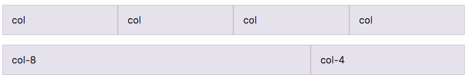
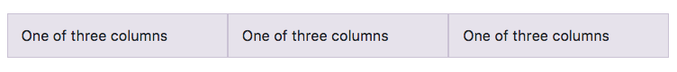
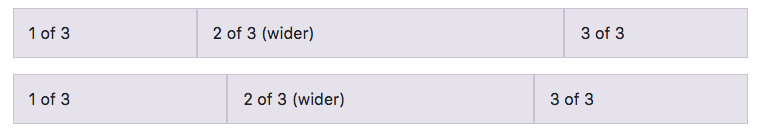

## Bootstrapでレスポンシブ対応させる（グリッド）

Bootstrapのグリッド（Grid）を使うと、とても簡単に整ったレスポンシブデザインのページを作成することが可能です。
`flexbox`を使用して作られているので、レイアウトもしやすいのが特徴です。

公式ドキュメントにも詳細は載っているので、ここで一部抜粋して基本的な使い方を紹介していきます。

まずは基礎的な使い方から見ていきましょう。

## グリッドOptions

Bootstrapのグリッドは`px`単位でブレークポイント（画面が切り替わる横幅の基準）を決めています。
公式ドキュメントにある使用例の一覧をまずは見てみましょう。

Bootstrapには**グリッドシステム**という仕組みがあり、横幅を12カラムとして、均等に区切ったときに、何カラム分の横幅を割り当てるかを指定するだけで要素を配置していくことが可能です。



レスポンシブデザインはグリッドを使えば全て解決するというわけではないので、グリッドは必要に応じて使えばよく、グリッドを使わずにページを作る方が良い場合も状況に応じてあります。


### 実例１：基本滴な使い方

実際にグリッドを使ってみましょう。

```html
<div class="container">
  <div class="row">
    <div class="col-sm">
      One of three columns
    </div>
    <div class="col-sm">
      One of three columns
    </div>
    <div class="col-sm">
      One of three columns
    </div>
  </div><!-- /.row -->
</div>
```



`col-sm`の`sm`は`smallサイズ`という意味合いで書かれています。
`col-`の後にサイズ指定を以下の一覧表にある指定されたサイズ表記で書いていくことで、横幅を調整することができます。

smallサイズより大きい幅で設定したい場合は`md`、`lg`、`xl`にサイズを変更することで設定できます。


もう一つ、グリッドを使用する際に気をつけておくこととして、グリッドを使用する要素を上記のソースコードのように`div`タグで`row`クラスに設定して囲む必要があります。
さらに、`<div class="row"></div>`で囲んである`div`要素を囲む、`<div class="container"></div>`も、上記`row`の親要素としてそれぞれの要素を均等にページ内に配置させるために設定が必要です。

下記にも例を示していますが、この書き方は`Equal-Width`という書き方です。`Equal-Width`は、自動的に要素の幅がそれぞれ均等になるように配置することができます。
上記の例だと、`sm`とサイズの指定をしているので、`sm`サイズで要素全てが均等な横幅になるように配置されています。

### 実例２：Equal-Width

上記の例とは少し異なる書き方ですが、同じ`Equal-Width`とカテゴライズされる書き方です。
上記と異なり、サイズの指定をしていませんが、全ての要素の幅が均等になります。
この書き方を`predefined grid class`と言います。

```html
<div class="container">
  <div class="row">
    <div class="col">
      1 of 2
    </div>
    <div class="col">
      2 of 2
    </div>
  </div><!-- /.row -->
  <div class="row">
    <div class="col">
      1 of 3
    </div>
    <div class="col">
      2 of 3
    </div>
    <div class="col">
      3 of 3
    </div>
  </div><!-- /.row -->
</div><!-- /.container -->
```


こちらの実例２では、サイズの指定をする表記をしていませんが、どの端末、viewportにも対応しています。
全ての要素が横幅いっぱいに均等に並んでいるのが確認できますね。
ただし、Safariにはflexboxのバグでうまく表示がされない場合もあるため、基本的にはサイズの指定をする表記を書くことを勧めます。

### 実例３：中央の1カラムの幅だけ設定し、残りの要素は自動設定

flexboxの`auto-layout`という性質を利用した書き方です。
1つの特定の要素のみ横幅の長さを決めたら、残りの隣り合う要素は自動で横幅を調整してくれるという大変便利な機能です。
中央にある要素がどんなサイズだろうと、両端にある要素はリサイズするので、中央の要素だけサイズを変えたいときに推奨される書き方です。
中央の要素だけサイズを決めればいいので、両端の要素は、`predefined grid class`でも構いません。

```html
<div class="container">
  <div class="row">
    <div class="col">
      1 of 3
    </div>
    <div class="col-6">
      2 of 3 (wider)
    </div>
    <div class="col">
      3 of 3
    </div>
  </div><!-- /.row -->
  <div class="row">
    <div class="col">
      1 of 3
    </div>
    <div class="col-5">
      2 of 3 (wider)
    </div>
    <div class="col">
      3 of 3
    </div>
  </div><!-- /.row -->
</div><!-- /.container -->
```



ここではサイズ指定してある中央の要素に数字でサイズ指定がされています。
Bootstrapでは全体の横幅を12等分して均等に分割する仕組みなので、数字で設定することでより細かいサイズ指定ができます。

### 実例４：横幅に変数を指定する（Variable width content）

`col-{breakpoint}-auto`をクラス属性に使用することで、要素の横幅を決めることもできます。
`col-{breakpoint}-auto`の`breakpoint`には`sm`や`lg`などの表記でサイズを決めることができます。
`col-{breakpoint}-数字`はver 3でもよく使われていた書き方で、12カラムを基準とした時の横幅をさらに調整できます。

```html
<div class="container">
  <div class="row justify-content-md-center">
    <div class="col col-lg-2">
      1 of 3
    </div>
    <div class="col-md-auto">
      Variable width content
    </div>
    <div class="col col-lg-2">
      3 of 3
    </div>
  </div><!-- /.row /.justify-content-md-center -->
  <div class="row">
    <div class="col">
      1 of 3
    </div>
    <div class="col-md-auto">
      Variable width content
    </div>
    <div class="col col-lg-2">
      3 of 3
    </div>
  </div><!-- /.row -->
</div><!-- /.container -->
```


### 実例５：Equal-width multi-row

`Equal-width multi-row`の仕組みを使うことで、要素を全て横一列に並列させるだけでなく、ブレークポイントを指定した箇所からはレスポンシブ対応で、複数の行（multi-row）に指定することができます。

```html
<div class="row">
  <div class="col">col</div>
  <div class="col">col</div>
  <div class="w-100"></div><!-- w-100 をブレークポイントしたい箇所に指定する-->
  <div class="col">col</div>
  <div class="col">col</div>
</div><!-- /.row -->
```


`<div class="w-100"></div>`の箇所以降にある要素2つが、改行されて全体で2段構造に指定されているのがわかりますね。

`Equal-width multi-row`を有効化させるには、`w-100`をブレークポイント箇所に書くことで有効化されます。