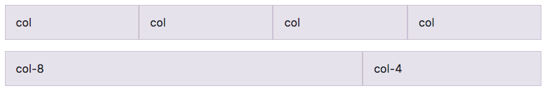
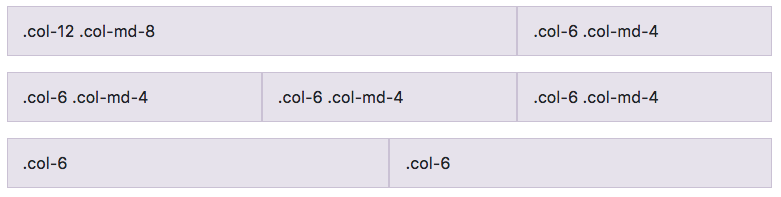

## レスポンシブ クラス

### 実例１：全端末統一する場合のブレークポイント（All breakpoints）

モバイルからデスクトップまで全端末同じ表示のさせ方で要素を配置したい場合は、この`All breakpoints`の方法が使えます。

`col`で全要素を均等に自動調整させるか、`col-数字`で特定の要素だけ横幅を指定するかどちらでも構いません。

```html
<div class="row">
  <div class="col">col</div>
  <div class="col">col</div>
  <div class="col">col</div>
  <div class="col">col</div>
</div><!-- /.row -->
<div class="row">
  <div class="col-8">col-8</div>
  <div class="col-4">col-4</div>
</div><!-- /.row -->
```



### 実例２：組み合わせて使う（Mix and match）

全端末統一して要素の配置を設定することは、レスポンシブデザインが主流になっている今、あまり使う頻度はそうないでしょう。

レスポンシブデザインをより細かく、かつ簡単に実装できるよう開発されたBootstrapなので、もちろん、端末によって細かく指定する方法も用意されています。

以下の例を見てみましょう。

```html
<!-- col-12はモバイルだと全画面、col-6はモバイルだと50%の横幅 -->
<div class="row">
  <div class="col-12 col-md-8">.col-12 .col-md-8</div>
  <div class="col-6 col-md-4">.col-6 .col-md-4</div>
</div><!-- /.row -->

<!-- col-6はモバイルだと50%幅、col-md-4はデスクトップになった時には要素が33.3%になる -->
<div class="row">
  <div class="col-6 col-md-4">.col-6 .col-md-4</div>
  <div class="col-6 col-md-4">.col-6 .col-md-4</div>
  <div class="col-6 col-md-4">.col-6 .col-md-4</div>
</div><!-- /.row -->

<!-- モバイルでもデスクトップでも常に50%幅 -->
<div class="row">
  <div class="col-6">.col-6</div>
  <div class="col-6">.col-6</div>
</div><!-- /.row -->
```



1行目の要素はモバイル画面とそれ以外の端末の時とで、要素の配列指定を変えています。
モバイル画面では全体で2行になり、それ以外の端末では要素を並列させて1行に納めています。

2行目の要素はモバイル端末とデスクトップ端末になった場合でブレークポイントを指定しています。
モバイルでは全ての要素が均等に50%幅ずつになるのに対し、デスクトップでは33.3%に横幅が変わるよう指定しています。

3行目の要素は、レスポンシブデザインではなく、全端末で同じ表示をさせる指定です。
要素がそれぞれ50%ずつで並列してどの端末でも表示されるように指定しています。

## その他の応用方法

その他にも、要素間で間隔を開けるなどの方法もありますが、基本的にはflexboxでも似たことができるので、詳細はBootstrap公式ドキュメントを参照しましょう。

## 更に学ぼう

- [Bootstrap公式](https://getbootstrap.com/)
